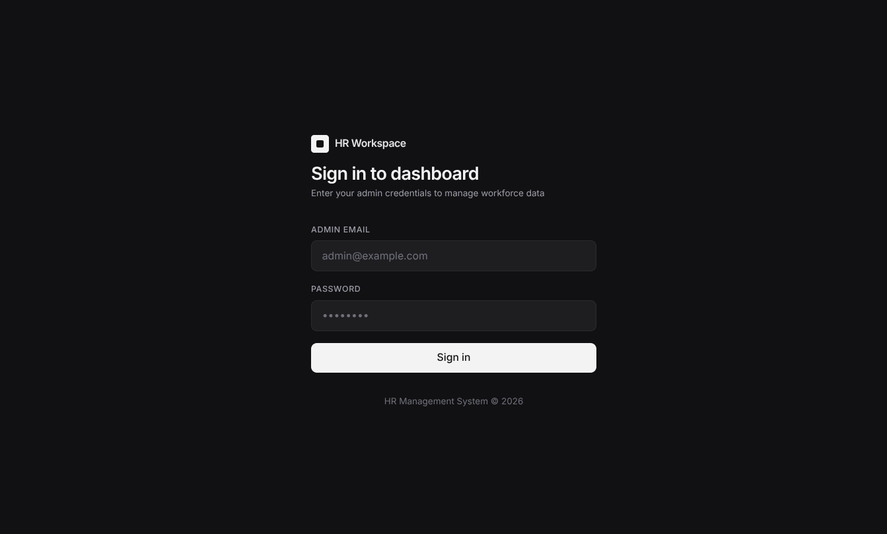
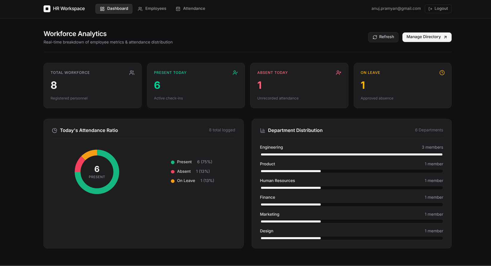
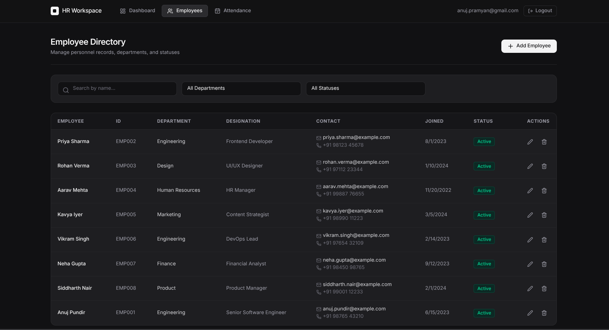
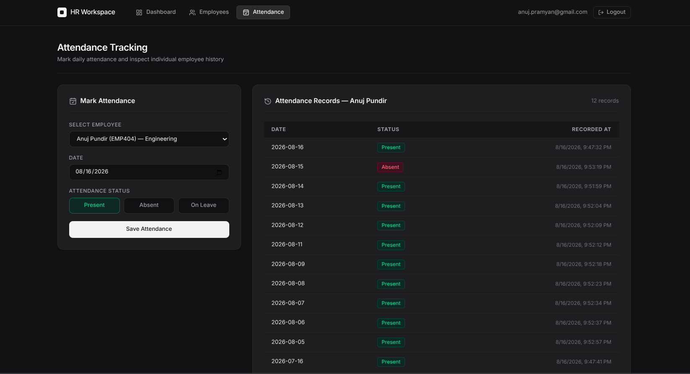
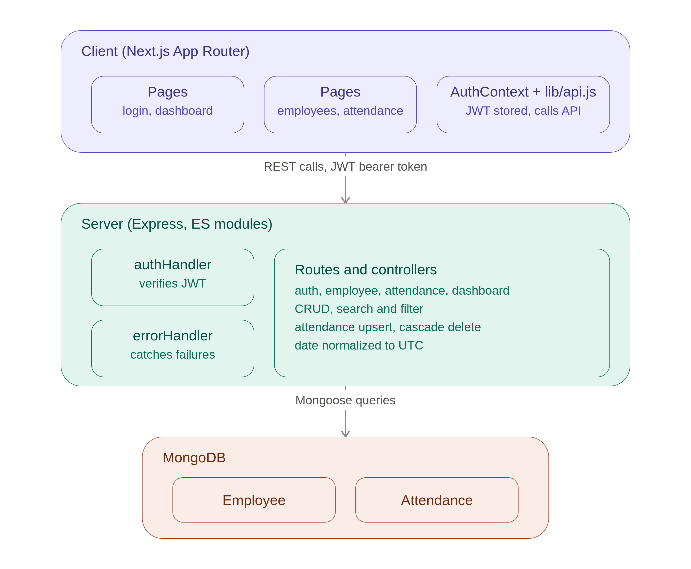

# HR Management Workspace

A full-stack HR Management Dashboard designed for employee profile administration, attendance tracking, search & filter capabilities, and workforce analytics.

---

## Visual Walkthrough & Screenshots

### 1. Authentication (`/login`)


### 2. Analytics Dashboard (`/dashboard`)


### 3. Employee Directory (`/employees`)


### 4. Attendance Tracking (`/attendance`)


### 5. System Architecture Diagram


---

## Tech Stack

- **Frontend**: Next.js (App Router), React, Tailwind CSS, Lucide React
- **Backend**: Node.js, Express.js (ES Modules)
- **Database**: MongoDB & Mongoose
- **Authentication**: JSON Web Token (JWT)

---

## Features

- **Authentication**: Secure JWT authentication based on admin environment credentials.
- **Employee CRUD**: Complete profile management (Name, Employee ID, Department, Designation, Email, Phone, Date of Joining, Status).
- **Attendance Tracking**: Record daily status (Present, Absent, On Leave) with date normalization and automatic upserting (no duplicate entries per day).
- **Workforce Analytics**: Live dashboard with summary metric cards, custom attendance ratio chart, and department distribution bars.
- **Search & Filter**: Real-time name search, department dropdown, and status filter.
- **Edge Case Protection**: Input validation, duplicate key prevention, automatic attendance cascade deletion upon employee removal, and unauthenticated request redirection.

## Project Structure

```text
pramyan-assignment
├── client
│   ├── app
│   │   ├── attendance
│   │   │   └── page.js
│   │   ├── dashboard
│   │   │   └── page.js
│   │   ├── employees
│   │   │   └── page.js
│   │   ├── login
│   │   │   └── page.js
│   │   ├── globals.css
│   │   ├── icon.svg
│   │   ├── layout.js
│   │   └── page.js
│   ├── components
│   │   └── Navbar.js
│   ├── context
│   │   └── AuthContext.js
│   ├── lib
│   │   └── api.js
│   ├── .env.example
│   └── package.json
│
├── server
│   ├── config
│   │   └── db.js
│   ├── controllers
│   │   ├── attendanceController.js
│   │   ├── authController.js
│   │   ├── dashboardController.js
│   │   └── employeeController.js
│   ├── middleware
│   │   ├── authHandler.js
│   │   └── errorHandler.js
│   ├── models
│   │   ├── Attendance.js
│   │   └── Employee.js
│   ├── routes
│   │   ├── attendanceRoutes.js
│   │   ├── authRoutes.js
│   │   ├── dashboardRoutes.js
│   │   └── employeeRoutes.js
│   ├── .env.example
│   ├── package.json
│   └── server.js
│
└── README.md
```

---

## Environment Variables

### Server (`server/.env`)
```ini
PORT=5000
MONGODB_URI=mongodb+srv://<username>:<password>@<cluster>.mongodb.net/hr_dashboard
ADMIN_EMAIL=admin@example.com
ADMIN_PASSWORD=adminpassword123
JWT_SECRET=supersecretjwtkey
```

### Client (`client/.env.local`)
```ini
NEXT_PUBLIC_API_URL=http://localhost:5000
```

---

## Getting Started

### 1. Backend Setup

```bash
cd server
npm install
npm run dev
```

The Express API server will start on `http://localhost:5000`.

### 2. Frontend Setup

```bash
cd client
npm install
npm run dev
```

The Next.js application will run on `http://localhost:3000`.

---

## System Assumptions & Technical Decisions

1. **Authentication**: Uses hardcoded environment credentials (`ADMIN_EMAIL` & `ADMIN_PASSWORD`) for single admin access.
2. **Attendance Uniqueness**: Attendance is constrained by a compound index `(employeeId, date)`. Re-submitting attendance for the same employee and date updates the existing record rather than creating a duplicate.
3. **Cascade Deletion**: When an employee record is deleted, all associated attendance records for that employee are automatically deleted from the database.
4. **Date Normalization**: Dates are normalized to UTC start-of-day for consistent date comparisons across timezones.

---

## Major API Endpoints

- **Auth**: `POST /auth/login`
- **Employees**:
  - `POST /employees`
  - `GET /employees?name=&department=&status=`
  - `GET /employees/:id`
  - `PUT /employees/:id`
  - `DELETE /employees/:id`
- **Attendance**:
  - `POST /attendance`
  - `GET /attendance/:employeeId`
- **Dashboard**:
  - `GET /dashboard/summary`
- **Health Check**: `GET /health`
